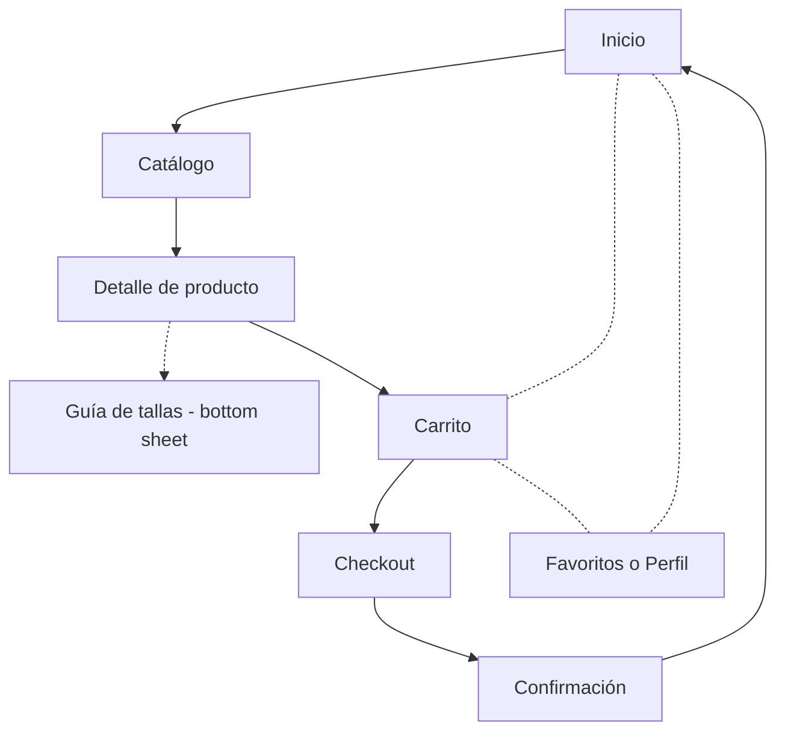

# Documentación de la interfaz — Chiribita

## 1. Justificación del diseño

### 1.1 Importancia del diseño centrado en el usuario

Quien compra ropa infantil casi nunca tiene tiempo. Abre la app en el autobús, en la puerta del colegio o con el niño tirándole de la manga, y lo hace con una mano. Si tiene que buscar el botón, ampliar la pantalla o adivinar qué hace cada icono, cierra y compra en otro sitio. Por eso el diseño de Chiribita parte de cómo se usa la app en esos momentos, y lo estético viene después.

Las tallas son el otro punto delicado. Los niños crecen rápido, cada marca mide distinto y un abuelo o un tío que regala ropa a veces ni sabe qué talla usa el niño. Si la interfaz no ayuda con eso, el pedido se queda a medias o vuelve como devolución. Probar el prototipo con gente de verdad, aunque sean compañeros de clase, permite pillar estos fallos antes de que la app esté hecha.

### 1.2 Objetivos y metas del proyecto

Me marco tres objetivos, todos medibles sobre el prototipo. El primero es de rapidez: que alguien que no ha usado nunca la app pueda hacer una compra completa, de Inicio a Confirmación, en menos de 2 minutos. Lo cronometraré en las pruebas con usuarios.

El segundo va de tallas. Quiero que al menos 8 de cada 10 intentos de elegir talla salgan bien sin pedir ayuda, apoyándose en el selector y en la guía de tallas.

El tercero es de accesibilidad: áreas táctiles de 48×48 dp o más y un contraste de 4,5:1 (WCAG AA) en todas las parejas de color. Este no depende de los usuarios, se comprueba en la guía de estilo y directamente en Figma.

### 1.3 Beneficios esperados

Para quien compra, lo importante es ahorrar tiempo y dudas: llega al producto en pocos toques y tiene una guía de tallas a mano antes de decidir.

Para la tienda el beneficio se nota en las cuentas. Menos carritos abandonados, menos devoluciones por talla equivocada y una app que sigue las pautas de Android, algo que da más confianza a la hora de pagar desde el móvil. Y validar el prototipo antes de programar evita pagar por rehacer cosas después.

## 2. Investigación y análisis de usuarios

### 2.1 Datos demográficos y segmentación

La app es para adultos que compran ropa y calzado de 0 a 14 años, no para los niños. Dentro de ese grupo veo tres tipos de persona bastante distintos.

Los padres y madres compran a menudo y con poco tiempo, porque los niños crecen y la ropa se estropea rápido. Los abuelos compran más por cariño o por regalo, y suelen manejarse peor con el móvil. Y están los amigos y familiares que solo aparecen en un cumpleaños y no tienen ni idea de qué talla usa el niño.

Casi todos compran desde un móvil Android y con una sola mano, en ratos sueltos del día. Para el prototipo me centro en los dos primeros grupos, que son los que más pedidos hacen. Al tercero lo cubro con la búsqueda por edad.

### 2.2 Personas

#### Persona 1: Marta, 34 años

Marta vive en Sevilla con su pareja y sus dos hijos, Lucía, de 6 años, y Hugo, de 2. Trabaja por turnos en un hospital y casi siempre compra desde el móvil, de noche o en algún descanso. No puede permitirse perder el tiempo, y menos todavía hacer una devolución, porque cada una es otro viaje que no tiene hueco para hacer.

Lo que quiere es reponer la ropa de temporada rápido, saber qué talla pedir sin darle vueltas y tener guardados algunos favoritos para cuando haya rebajas.

Lo que le saca de quicio es que la talla 4 de una marca no se parezca en nada a la de otra, que los filtros desaparezcan al volver atrás y que el pago le pida más datos de los necesarios.

#### Persona 2: Antonio, 67 años

Antonio es jubilado, vive en Dos Hermanas y tiene tres nietos. Les compra ropa en los cumpleaños y en Navidad. Usa el móvil sobre todo para WhatsApp y para llamar, y se pone nervioso cuando pulsa algo y no entiende qué ha pasado.

Quiere encontrar un regalo que le valga a su nieta de 5 años sin tener que llamar a su hija para preguntarle la talla, y llegar hasta el final de la compra sin pedir ayuda.

Le frustran las letras pequeñas, los iconos sin ninguna palabra al lado y no saber qué talla es la «de 5 años». Lo que más teme es borrar sin querer lo que ya había elegido.

### 2.3 Análisis de la competencia

Para ver cómo resuelven otras tiendas lo mismo que quiero resolver yo, he revisado tres apps: Mayoral, H&M y Vertbaudet. En las tres he seguido la misma tarea: buscar un pijama de 4 años y llegar al carrito.

| App | Qué hace bien | Qué hace mal | Qué me llevo |
|---|---|---|---|
| Mayoral | Ordena todo por edades, de bebé a adolescente, que es como piensa quien compra para un niño. Se puede seguir el estado del pedido desde la app. | La talla va por edad y altura a la vez, y eso despista a quien regala. La guía de tallas no está a un toque desde el producto. | Organizar el inicio por edad y poner la guía de tallas dentro del detalle. |
| H&M | Filtros muy completos (talla, color, precio), favoritos a mano y un pago rápido. | Hay tanto catálogo y tanta información en pantalla que cuesta centrarse. La ropa de niños queda mezclada con el resto. | Los filtros en forma de chips y el botón de favoritos siempre visible. |
| Vertbaudet | Se dedica solo a ropa de niños y bebés, así que todo está pensado para ese público. Las tallas se explican con edad y altura. | Muchas promociones y banners que empujan el producto hacia abajo y alargan la búsqueda. | Una pantalla de inicio limpia, sin ruido, y tallas explicadas con claridad. |

### 2.4 Insights y hallazgos clave

**1. La talla es la mayor duda al comprar.** A Marta le cambia la talla 4 según la marca, y Antonio no sabe cuál es la «de 5 años» de su nieta. Mayoral, además, mezcla edad y altura. Por eso el detalle de producto lleva un selector de talla propio y un botón «Guía de tallas» que abre un bottom sheet, así nadie sale de la pantalla para resolver la duda.

**2. Se compra con una mano y con prisa.** Marta compra en los descansos del turno. Para que llegue al botón con el pulgar, la navegación va abajo en una navigation bar y los botones principales también se quedan en la parte baja. Todo lo pulsable mide al menos 48×48 dp.

**3. Quien regala piensa en la edad, no en la talla ni en la marca.** Es lo que hace bien Mayoral y lo que echa en falta Antonio en las demás. Así que el inicio se organiza en Bebé 0-24 m, Niña y Niño, y el catálogo permite filtrar por edad y talla con chips.

**4. Los usuarios con menos soltura temen equivocarse.** A Antonio le asusta borrar lo que ya había elegido y perderlo todo. Por eso, al eliminar algo del carrito aparece un snackbar con «Deshacer», y el resumen del importe se ve siempre. En el checkout, los errores se explican con un mensaje que dice qué falta y cómo arreglarlo.

## 3. Diseño de la interfaz

### 3.1 Mapa de navegación

El recorrido principal de compra va de Inicio a Confirmación pasando por el catálogo, el detalle del producto, el carrito y el checkout, y se marca con flechas continuas. La guía de tallas no es una pantalla aparte: se abre encima del detalle como un bottom sheet, y por eso la flecha es punteada. Las líneas punteadas sin punta son los accesos de la navigation bar, que lleva a Inicio, Carrito y Favoritos desde cualquier pantalla.

### 3.2 Wireframes

### 3.3 Guía de estilo Material Design 3

### 3.4 Prototipo de alta fidelidad

## 4. Validación y pruebas

### 4.1 Metodología

### 4.2 Resultados

### 4.3 Iteraciones y mejoras

## 5. Entrega y documentación final

### 5.1 Justificación del diseño propuesto

### 5.2 Recomendaciones y pasos a seguir

## 6. Referencias bibliográficas

Palabra del día: 29